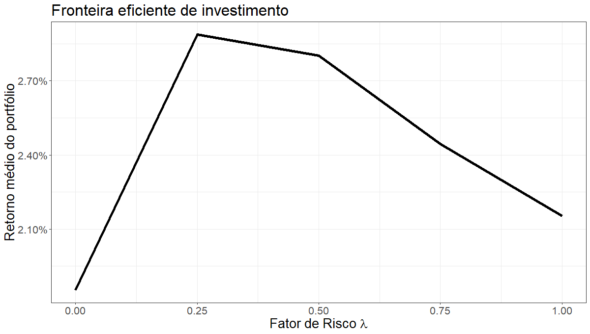

Markowitz portfolio allocation
==============================

This package uses the Markowitz Mean-Variance model to analyze stocks and choose an allocation that
considers the desired risk level - defined by the parameter lambda.

It seeks to find the efficient investment frontier, so you can have an allocation according to the
expected risk.

